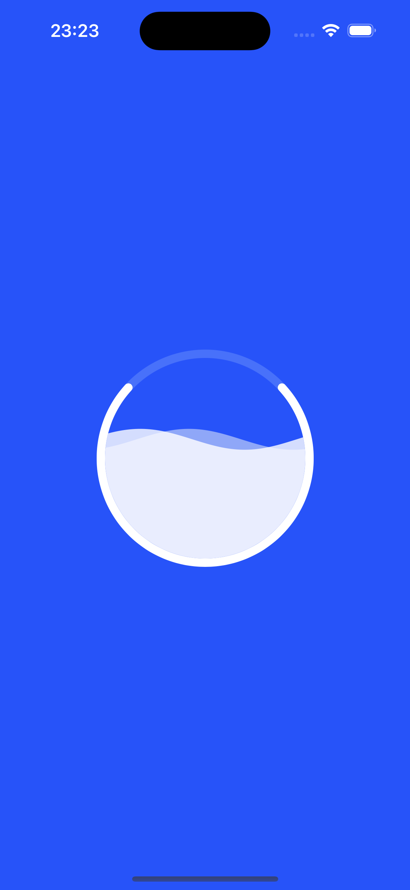

# Download animation 

Show download status with animation in SwiftUI.
## Inspiration 💡

The main idea of this source code based on [Download Loading](https://dribbble.com/shots/15041751-Download-animation) created by [Yeasin Arafat](https://dribbble.com/yeasindesign).

## Screenshots 🌃



## Tools

- Xcode 15.2
- Swift 5.9.2

## Usage

1. Clone the repository:

  ``` bash
    git clone https://github.com/helloItsHEssam/AnalyzingGoalsLoading.git
  ```

###  Contributing 🤝

Contributions, issues, and feature requests are welcome! Feel free to fork the repository and submit a pull request with your changes.

## License

Please check [LICENSE](LICENSE) for details.